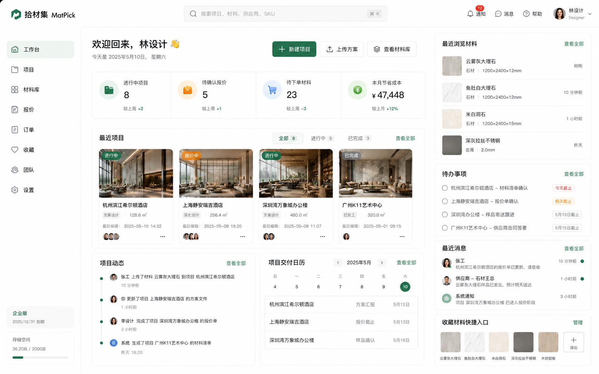
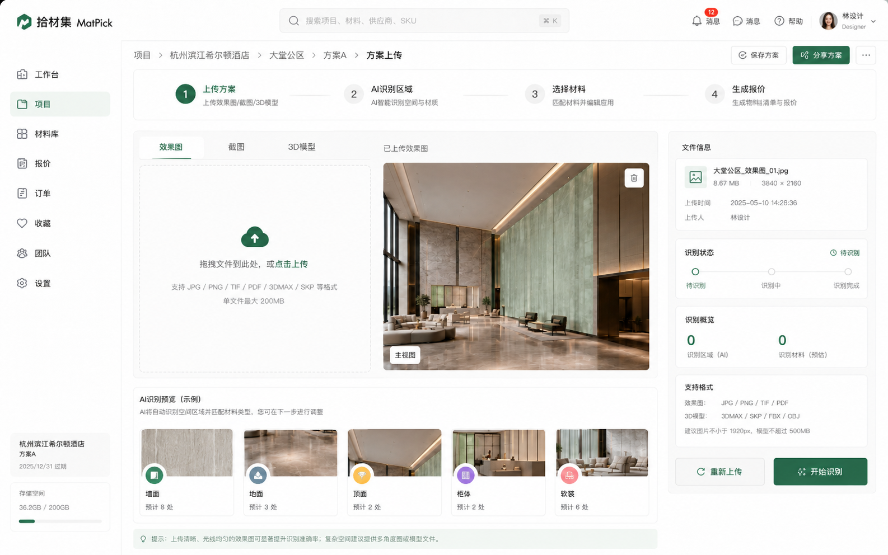
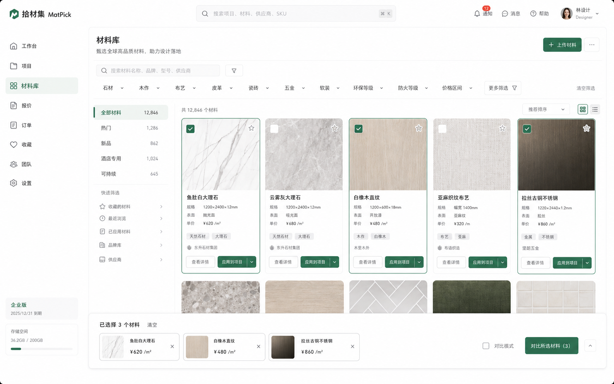
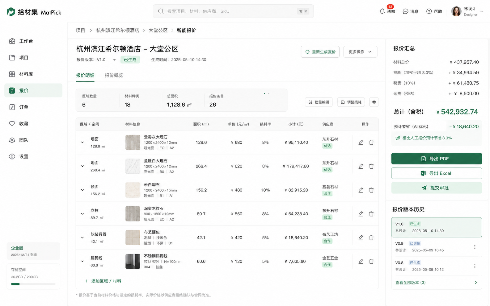
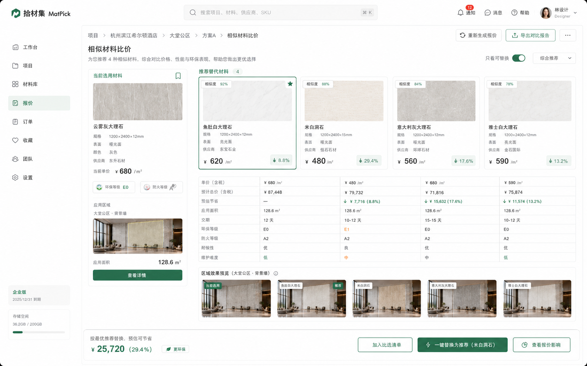
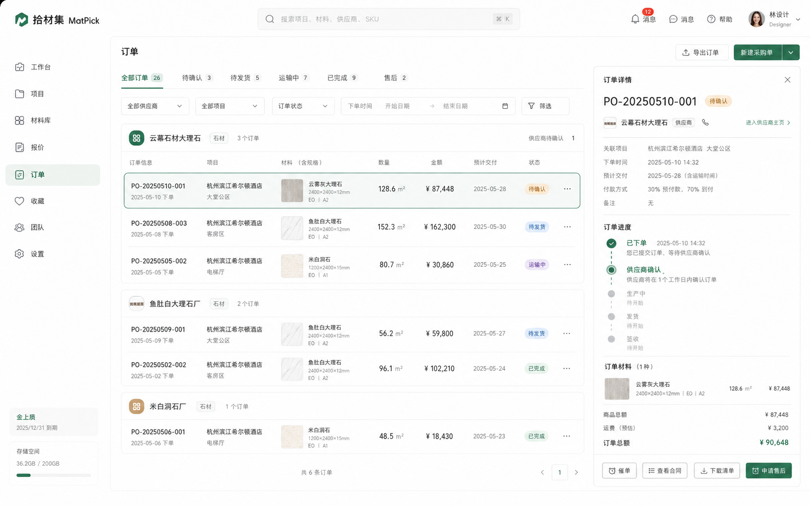
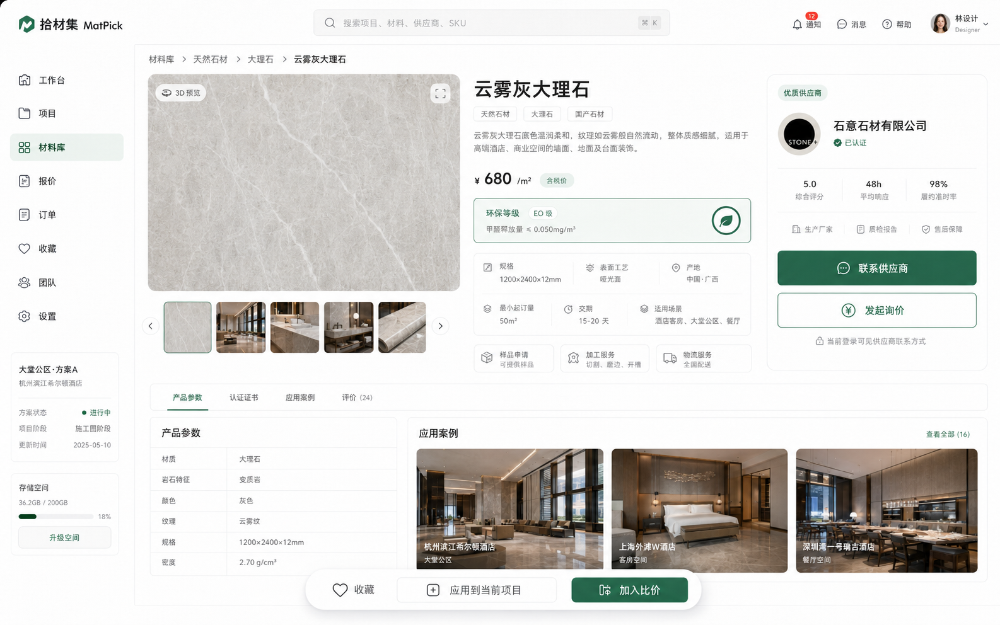

<div align="center">

# 拾材集 · MatPick

**面向酒店 / 商业空间设计师的材料协同 SaaS 平台 · V1.0 MVP**

A material-collaboration SaaS for hotel & commercial-space designers · V1.0 MVP

</div>

---

> 🌐 [Switch to English](README.en.md)

## 项目简介

拾材集把「找材料 → AI 区域识别 → 材质替换预览 → 智能报价 → 供应商订货」整条链路收进一个工作区——**设计师端**告别在 Excel、聊天群与供应商电话间反复切换，从上传效果图到出报价单全程留在同一页面；**材料供应商端**获得结构化的数字订单通路，询价、确认、发货、售后状态一目了然，减少大量人工对账沟通。

## 产品截图

<table>
<tr>
<td width="50%">
<b>工作台</b><br/>

</td>
<td width="50%">
<b>方案上传 + AI 区域识别</b><br/>

</td>
</tr>
<tr>
<td width="50%">
<b>材质替换工作区</b><br/>

</td>
<td width="50%">
<b>材料库</b><br/>

</td>
</tr>
<tr>
<td width="50%">
<b>智能报价</b><br/>

</td>
<td width="50%">
<b>相似材料比价</b><br/>

</td>
</tr>
<tr>
<td width="50%">
<b>订单管理</b><br/>

</td>
<td width="50%">
<b>材料详情</b><br/>

</td>
</tr>
</table>

## 核心功能

| 功能 | 说明 |
| --- | --- |
| 🪄 **AI 区域识别** | 上传效果图后自动识别墙面 / 地面 / 顶面 / 柜体 / 软装区域并测算面积 |
| 🎨 **材质替换工作区** | 在效果图上选区，从材料库一键替换并实时预览替换前后对比 |
| 📚 **材料库** | 12000+ 材料 SKU，支持分类、环保 / 防火等级、价格区间筛选与多选比价 |
| 💰 **智能报价** | 自动按区域 × 材料 × 损耗 × 税费 × 运费生成报价单，带版本历史 |
| 🔄 **相似材料比价** | AI 推荐相似材料，按相似度、单价、交期、节省额度排序，一键替换 |
| 📦 **订货协同** | 按供应商分组下单，订单状态时间线（待确认 / 待发货 / 运输中 / 已完成 / 售后） |
| 👥 **团队协作** | 项目动态、待办、消息、协作成员，多人共同推进方案 |

## 快速开始

```bash
# 建议 Node.js ≥ 18.18
npm install
npm run dev          # http://localhost:3000，默认跳转 /dashboard

# 生产构建
npm run build && npm start
```

建议使用 1440 px 及以上宽度的浏览器窗口体验。

## 技术栈

| 模块 | 选择 | 说明 |
| --- | --- | --- |
| 前端框架 | Next.js 14 (App Router) | 文件路由 + RSC，便于未来接入服务端 API |
| 类型系统 | TypeScript 5 | 全部业务模型集中在 `lib/types.ts` |
| 样式 | Tailwind CSS 3 | `tailwind.config.ts` 内置品牌色与设计 token |
| 图标 | lucide-react | 与品牌的简洁设计语言一致 |
| Mock 数据 | 本地 TS 模块（`lib/mock/*`） | 字段命名贴近真实接口，便于平移到 REST/GraphQL |
| 视觉素材 | 程序化绘制（SVG + 渐变） | 不依赖外部图床，完全离线可演示 |

## 目录结构

```
app/
  (app)/
    dashboard/          # 工作台
    projects/[id]/
      upload/           # 方案上传 + AI 识别
      workspace/        # 材质替换工作区（核心）
      quote/            # 智能报价
    materials/[id]      # 材料库 + 详情
    compare/            # 相似材料比价
    orders/             # 订单
components/
  layout/               # Sidebar / Header / Logo / 面包屑
  ui/                   # Button / Card / Badge / Input 等
lib/
  types.ts              # 业务实体类型
  mock/                 # 项目、材料、供应商、报价、比价、订单、社交数据
```

## 后续接入建议

1. **AI 识别 / 材质替换** — SAM2 输出多边形掩码 + Diffusion + ControlNet 做纹理替换
2. **文件上传** — dropzone 替换为 S3 / OSS 预签名 PUT
3. **报价导出** — `@react-pdf/renderer` 生成 PDF；`exceljs` 生成 .xlsx
4. **供应商对接** — 开放询价 + 订单创建接口；ERP webhook 回填订单状态
5. **全局搜索** — 接入 Meilisearch / Typesense，⌘ K 命令面板

## 已知限制

- 视觉素材为程序化绘制，仅用于演示流程
- 表单交互为前端模拟，未持久化，刷新后状态重置
- 暂无单元测试 / e2e

## 许可

仅用于内部演示与设计验收。
