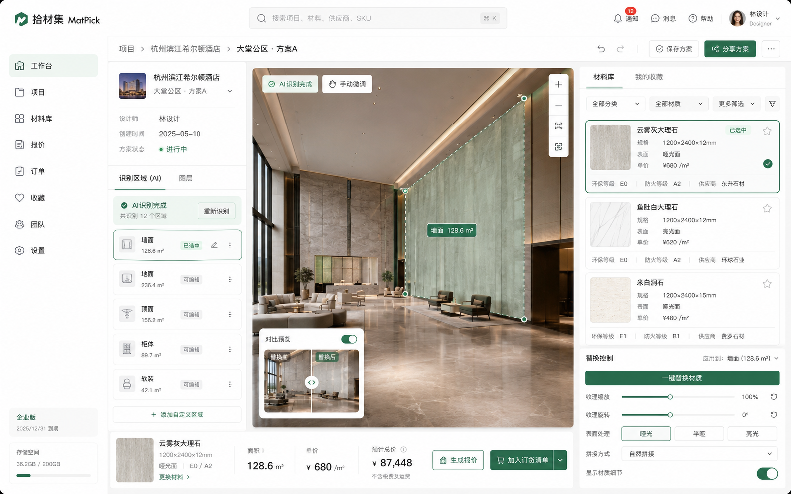

<div align="center">

# 拾材集 · MatPick

**面向酒店 / 商业空间设计师的材料协同 SaaS 平台 · V1.0 MVP**

A material-collaboration SaaS platform for hotel & commercial-space designers · V1.0 MVP

</div>

---

## 项目简介 · Overview

**拾材集（MatPick）** 是一个面向酒店设计师、商业空间设计师与设计公司项目负责人的电脑端 SaaS 平台。它把"找材料 → 上方案 → 看效果 → 算报价 → 发订单"这条原本散落在 Excel、聊天群和供应商电话里的流程，整合到一个工作区里完成。

**MatPick** is a desktop SaaS that lets hotel and commercial interior designers handle the full *find material → upload plan → preview → quote → order* loop in one workspace, instead of bouncing between spreadsheets, group chats, and supplier calls.

### 核心功能 · Key features

| 功能 · Feature | 说明 · Description |
| --- | --- |
| 🪄 **AI 区域识别** · AI region detection | 上传效果图后自动识别墙面 / 地面 / 顶面 / 柜体 / 软装等区域并测算面积 |
| 🎨 **材质替换工作区** · Material workspace | 在效果图上选区，从材料库一键替换并实时预览替换前后对比 |
| 📚 **材料库** · Material library | 12000+ 材料 SKU，支持分类、环保 / 防火等级、价格区间筛选与多选比价 |
| 💰 **智能报价** · Smart quote | 自动按区域 × 材料 × 损耗 × 税费 × 运费生成报价单，带版本历史 |
| 🔄 **相似材料比价** · Similar-material comparison | AI 推荐相似材料，按相似度、单价、交期、节省额度排序，一键替换 |
| 📦 **订货协同** · Supplier orders | 按供应商分组下单，订单状态时间线（待确认 / 待发货 / 运输中 / 已完成 / 售后） |
| 👥 **团队协作** · Team collaboration | 项目动态、待办、消息、协作成员，多人共同推进方案 |

### 产品截图 · Screenshots

#### 方案上传 + AI 识别 · Plan upload + AI recognition


#### 材质替换工作区 · Material replacement workspace


#### 相似材料比价 · Similar-material comparison


---

<a id="简体中文"></a>

## 简体中文

> 切换语言：**简体中文** ｜ [English](#english)

面向酒店与商业空间设计师的材料协同平台前端原型。所有 AI、报价、供应商交互均由本地 mock 数据驱动，可独立运行用于演示与设计验收。

### 快速开始

```bash
# 建议 Node.js ≥ 18.18
npm install
npm run dev          # http://localhost:3000，默认跳转 /dashboard

# 生产构建
npm run build && npm start
```

建议使用 1440 px 及以上宽度的浏览器窗口体验。

### 技术栈

| 模块         | 选择                          | 说明                                                 |
| ------------ | ----------------------------- | ---------------------------------------------------- |
| 前端框架     | Next.js 14 (App Router)       | 文件路由 + RSC，便于未来接入服务端 API               |
| 类型系统     | TypeScript 5                  | 全部业务模型集中在 `lib/types.ts`                    |
| 样式         | Tailwind CSS 3                | `tailwind.config.ts` 内置品牌色与设计 token          |
| 图标         | lucide-react                  | 与品牌的简洁设计语言一致                             |
| Mock 数据    | 本地 TS 模块（`lib/mock/*`）  | 字段命名贴近真实接口，便于平移到 REST/GraphQL        |
| 视觉素材     | 程序化绘制（SVG + 渐变）      | 不依赖任何外部图床，完全离线可演示                   |

### 目录结构

```
app/
  layout.tsx            # 根 HTML / 全局样式
  page.tsx              # / → /dashboard 重定向
  globals.css           # 全局样式 + 自定义滚动条 + range slider
  (app)/                # 带左侧导航 + 顶部 Header 的应用 shell
    dashboard/          # 工作台
    projects/           # 项目列表
      [id]/             # 项目详情
        upload/         # 方案上传 + AI 识别模拟
        workspace/      # 材质替换工作区（核心交互）
        quote/          # 智能报价
    materials/[id]      # 材料库 + 详情
    quotes/             # 报价总览
    compare/            # 相似材料比价
    orders/             # 订单（按供应商分组）
    favorites/ team/ settings/
components/
  layout/               # Sidebar / Header / Logo / 面包屑
  ui/                   # Button / Card / Badge / Input / MaterialThumb / Scene 等
lib/
  types.ts              # 业务实体类型
  utils.ts              # cn / formatCurrency / relativeTime 等
  mock/                 # 项目、材料、供应商、报价、比价、订单、社交数据
docs/screenshots/       # README 中引用的产品截图
```

### 页面清单

| 路径                                | 页面                | 说明                                                                            |
| ----------------------------------- | ------------------- | ------------------------------------------------------------------------------- |
| `/dashboard`                        | 工作台              | 欢迎语、关键指标、最近项目、待办、消息、收藏入口、动态、交付日历                |
| `/projects`                         | 项目列表            | 状态/阶段/城市筛选 · 卡片视图                                                   |
| `/projects/[id]`                    | 项目详情            | 元数据 · 方案空间 · 协作 · 动态 · 同类项目                                      |
| `/projects/[id]/upload`             | 方案上传            | 4 步流程指示器 · 拖拽上传 · AI 识别状态条 · 跳转工作区                          |
| `/projects/[id]/workspace`          | 材质替换工作区      | 区域 SVG 选区 · 材料库 · 替换控制 · 对比预览 · 底部价格条                       |
| `/projects/[id]/quote`              | 智能报价            | 区域明细表 · 汇总卡（材料/损耗/税费/运费/总计） · 版本历史 · AI 节省提示        |
| `/quotes`                           | 报价总览            | 跨项目报价单一览                                                                |
| `/materials`                        | 材料库              | 分类 + 等级 + 价格筛选 · 卡片网格 · 多选对比浮动栏                              |
| `/materials/[id]`                   | 材料详情            | 多图、规格属性、供应商档案、应用案例、相关推荐                                  |
| `/compare`                          | 相似材料比价        | 当前 vs 推荐 双图对比 · 相似度 · 单价 / 交期 / 节省 · 一键采用                  |
| `/orders`                           | 订单                | 按供应商分组、状态筛选、订单详情侧边栏、进度时间线                              |
| `/favorites` `/team` `/settings`    | 收藏 / 团队 / 设置  | 配套页面                                                                        |

### Mock 数据说明

- `projects.ts` — 项目 + AI 识别区域多边形（百分比坐标，自适应不同画布尺寸）
- `materials.ts` — 材料 SKU、规格、供应商外键、环保/防火等级、案例
- `suppliers.ts` — 供应商档案 + 履约率 + 评分
- `quotes.ts` — 报价单 + 明细 + 历史版本，含 `calcQuoteSummary` 派生材料/损耗/税费/总计
- `comparisons.ts` — AI 比价候选 + 相似度 + 预计节省
- `orders.ts` — 订单实体 + 时间线
- `social.ts` — 待办、消息、动态、交付日历

字段命名与中文业务术语 1:1 对应（如 `lossRate`、`fireLevel`、`partnership`），减少未来联调成本。

### 主要交互

- 左侧导航在路由变化时高亮
- **工作区**：点击左侧区域 / 画布上多边形可切换选中；选中右侧材料卡片会实时改变 3D 场景墙面颜色与底部价格条
- **上传页**：「开始识别」触发 1.5s 模拟 → 跳转工作区
- **比价页**：点击候选行可切换大图右侧"替换后"预览与三项对比
- **订单页**：点击订单行打开右侧详情面板，含进度时间线

### 后续接入建议

1. **AI 识别 / 材质替换** — 推荐 SAM2 输出多边形掩码 + Diffusion + ControlNet 做纹理替换；`DetectedArea.polygon` 已是百分比坐标，零成本替换 mock。
2. **文件上传** — 上传页 dropzone 替换为 S3 / OSS 预签名 PUT；元数据写回 `Project.schemes`。
3. **报价导出** — 服务端 `@react-pdf/renderer` 生成 PDF；`exceljs` 生成 .xlsx 流。
4. **供应商对接** — 优先开放 询价 + 订单创建 接口；订单状态机由供应商端 ERP webhook 回填 `OrderTimelineEvent`。
5. **全局搜索** — Header 搜索框接入 Meilisearch / Typesense，⌘ K 命令面板。
6. **权限模型** — 在 layout 注入 `currentUser`，在路由级别检查权限。
7. **国际化** — 引入 `next-intl`，迁移所有展示字符串到 `messages/zh-CN.json`。

### 已知限制

- 视觉素材为程序化绘制，仅用于演示流程；接入真实文件上传 + AI 模型管线后即可获得真实效果图。
- 表单交互（上传 / 识别 / 生成报价）为前端模拟，未持久化，刷新后状态会重置。
- 暂无单元测试 / e2e。建议接入真实接口前补齐：
  - `vitest` 覆盖 `calcQuoteSummary`、`relativeTime` 等纯函数
  - `playwright` 覆盖「上传 → 识别 → 工作区 → 报价 → 订单」主流程

### 许可

仅用于内部演示与设计验收。

---

<a id="english"></a>

## English

> Switch language: [简体中文](#简体中文) ｜ **English**

A frontend prototype of a material-collaboration platform for hotel and commercial-space designers. AI, quoting, and supplier interactions are driven entirely by local mock data, so the app runs standalone for demos and design review.

### Quick start

```bash
# Node.js ≥ 18.18 recommended
npm install
npm run dev          # http://localhost:3000, redirects to /dashboard

# Production build
npm run build && npm start
```

Best viewed at ≥ 1440 px browser width.

### Tech stack

| Layer        | Choice                        | Notes                                                    |
| ------------ | ----------------------------- | -------------------------------------------------------- |
| Framework    | Next.js 14 (App Router)       | File routing + RSC, ready for future server APIs         |
| Types        | TypeScript 5                  | All domain types live in `lib/types.ts`                  |
| Styling      | Tailwind CSS 3                | Brand colors & design tokens in `tailwind.config.ts`     |
| Icons        | lucide-react                  | Matches the minimal brand language                       |
| Mock data    | Local TS modules (`lib/mock/*`) | Field names track real-API conventions for easy swap   |
| Visual assets| Procedural SVG + gradients    | No external image hosts; runs fully offline              |

### Directory layout

```
app/
  layout.tsx            # Root HTML / global styles
  page.tsx              # / → /dashboard redirect
  globals.css           # Global styles + scrollbar + range slider
  (app)/                # App shell (sidebar + header)
    dashboard/          # Dashboard
    projects/           # Project list
      [id]/             # Project detail
        upload/         # Plan upload + simulated AI recognition
        workspace/      # Material replacement workspace (core)
        quote/          # Smart quote
    materials/[id]      # Material library + detail
    quotes/             # All quotes
    compare/            # Similar-material comparison
    orders/             # Orders grouped by supplier
    favorites/ team/ settings/
components/
  layout/               # Sidebar / Header / Logo / Breadcrumbs
  ui/                   # Button / Card / Badge / Input / MaterialThumb / Scene …
lib/
  types.ts              # Domain entity types
  utils.ts              # cn / formatCurrency / relativeTime …
  mock/                 # projects, materials, suppliers, quotes, comparisons, orders, social
docs/screenshots/       # Product screenshots referenced in this README
```

### Pages

| Route                               | Page                        | Description                                                                          |
| ----------------------------------- | --------------------------- | ------------------------------------------------------------------------------------ |
| `/dashboard`                        | Dashboard                   | Welcome, KPIs, recent projects, todos, messages, favorites, activity, calendar       |
| `/projects`                         | Project list                | Status / stage / city filters · card view                                            |
| `/projects/[id]`                    | Project detail              | Metadata · scheme spaces · collaborators · activity · related projects               |
| `/projects/[id]/upload`             | Plan upload                 | 4-step stepper · drag-and-drop · AI status track · jumps to workspace                |
| `/projects/[id]/workspace`          | Material workspace          | SVG region picker · material library · replace controls · A/B preview · price bar    |
| `/projects/[id]/quote`              | Smart quote                 | Region table · summary (material / loss / tax / shipping / total) · version history  |
| `/quotes`                           | All quotes                  | Cross-project list                                                                   |
| `/materials`                        | Material library            | Category + level + price filters · card grid · floating multi-select bar             |
| `/materials/[id]`                   | Material detail             | Gallery, specs, supplier card, case studies, related items                           |
| `/compare`                          | Similar-material comparison | Current vs candidate scenes · similarity bar · price / lead-time / savings           |
| `/orders`                           | Orders                      | Supplier-grouped, status filter, detail side panel, progress timeline                |
| `/favorites` `/team` `/settings`    | Favorites / Team / Settings | Companion pages                                                                      |

### Mock data

- `projects.ts` — projects + AI-detected polygons (percentage coords, resolution-independent)
- `materials.ts` — material SKUs, specs, supplier FK, eco/fire ratings, cases
- `suppliers.ts` — supplier profile + fulfillment rate + rating
- `quotes.ts` — quotes + line items + version history; `calcQuoteSummary` derives material/loss/tax/total
- `comparisons.ts` — AI candidates + similarity + estimated savings
- `orders.ts` — orders + timeline events
- `social.ts` — todos, messages, activity feed, delivery calendar

Field names mirror the Chinese domain vocabulary 1:1 (`lossRate`, `fireLevel`, `partnership`) to minimize future API integration cost.

### Key interactions

- Sidebar highlights the active route
- **Workspace**: clicking a region in the left list or a polygon on the canvas selects it; picking a material card on the right instantly recolors the 3D scene and updates the bottom price bar
- **Upload**: "Start recognition" plays a 1.5 s simulated progress, then jumps to the workspace
- **Compare**: clicking a candidate row swaps the right-hand "after" scene and the three side-by-side metrics
- **Orders**: clicking an order opens the right detail panel with a progress timeline

### Production roadmap

1. **AI recognition / material replacement** — pair SAM2 segmentation with Diffusion + ControlNet for texture transfer; `DetectedArea.polygon` already uses percentage coords, so swapping mock for `/api/projects/:id/segments` is trivial.
2. **File upload** — replace the dropzone with S3 / OSS pre-signed PUT and persist metadata back to `Project.schemes`.
3. **Quote export** — server-side `@react-pdf/renderer` for PDF; `exceljs` stream for .xlsx.
4. **Supplier integration** — start with quote-request + order-create endpoints; let supplier ERPs push order state via webhook into `OrderTimelineEvent`.
5. **Global search** — wire the header search to Meilisearch / Typesense; add a ⌘ K command palette.
6. **Permissions** — inject `currentUser` at the layout layer and gate routes by role.
7. **i18n** — adopt `next-intl` and move all visible strings to `messages/zh-CN.json` (and `en-US.json`).

### Known limitations

- Visuals are procedurally generated — fine for flow demos. Real renders arrive once file upload + AI pipeline are wired.
- Form interactions (upload / recognition / quote generation) are mocked and not persisted; state resets on reload.
- No unit / e2e tests yet. Before going live, add:
  - `vitest` for `calcQuoteSummary`, `relativeTime`, etc.
  - `playwright` for the upload → recognition → workspace → quote → order golden path

### License

For internal demo and design review only.
